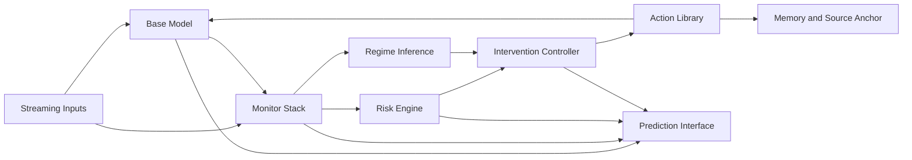

# Architecture Review and Long-Term Roadmap

## Executive Summary

The work so far suggests a clear architectural conclusion:

**The right object is not a single self-adapting model. It is a controller over multiple bounded adaptation primitives.**

This is the most important strategic update in the project.

The early synthetic and real-tabular results do **not** support the strongest possible claim:

- "unlabeled online adaptation will reliably outperform a frozen source model"

But they **do** support a narrower and more credible claim:

- "a controller can manage risk, choose among multiple interventions, and achieve better tradeoffs than naive continual adaptation"

That is already scientifically interesting, and it is probably closer to a real product architecture.

## What We Have Learned

### 1. Naive continual adaptation is easy to break

This result is stable across the current prototypes.

- always-adapt policies drift more
- they degrade more under bad regimes
- they create worse long-run behavior than controlled policies

This is consistent with the CTTA literature and strengthens the case for treating adaptation as a control problem.

### 2. Safety-gated controllers are already useful

Even before they improve absolute accuracy, the controllers are doing real work:

- suppressing runaway sequential risk alarms
- reducing parameter drift
- limiting overreaction to transient shift
- preserving a path back to source behavior

That means the "safety layer" is not just a wrapper. It is part of the core system.

### 3. A richer action space helps

The move from a single adaptation action to a multi-action controller was the first major conceptual win.

Once the system could choose among:

- `bn_refresh`
- `label_shift`
- `adapter_head_update`
- `reset`
- `hold`

the results became meaningfully better than the simpler controller, even if they still did not beat the frozen source model overall.

This strongly suggests that the controller needs a **menu of interventions**, not a single update mechanism.

### 4. The current adaptation primitive is still not enough

The current PyTorch tabular model is useful as a research scaffold, but it is not yet strong enough to establish that unlabeled adaptation can systematically recover performance under real shift.

That is not a failure of the project. It is a finding:

- the control problem is maturing faster than the adaptation-capacity problem

So the architecture should lean into that.

## Recommended Target Architecture

The best target architecture now looks like this:

This architecture has six important ideas.

### 1. Monitor stack, not single detector

We should assume no single statistic is enough.

The monitor stack should eventually include:

- latent distribution drift
- output drift
- confidence collapse
- sequential risk monitoring
- label-shift indicators
- graph-structural signals in graph domains

### 2. Explicit regime inference

The system should not just estimate "how shifted" the stream is. It should infer **what kind of shift** is happening.

Examples:

- mild covariate shift
- label shift
- recurring regime
- collapse-prone severe shift
- possible open-set or concept drift

That regime estimate should become part of the controller state.

### 3. Controller over bounded interventions

The controller should select the cheapest safe action, not just trigger one universal update.

The long-term action library should include:

- no-op
- BN refresh
- calibration update
- label-shift correction
- head-only update
- adapter update
- specialist routing
- reset
- abstain
- retraining recommendation

### 4. Source anchor and memory as first-class components

The system needs persistent reference structure:

- source model snapshot
- source calibration profile
- prototype or coreset memory
- trusted recent batches
- optional regime specialists

Without this, continual adaptation becomes drift without memory.

### 5. Reliability surface as an output product

The system should not only emit predictions. It should expose:

- prediction
- uncertainty or prediction set
- risk state
- shift diagnosis
- current intervention
- coverage / abstention status

That output surface is both scientifically useful and commercially valuable.

### 6. Decouple control from model internals

The controller should interact with the model through a standardized intervention interface.

That keeps the system extensible across:

- tabular models
- GNNs
- vision backbones
- black-box hosted models with limited adaptation hooks

## Recommended Research Thesis

The most credible thesis now is:

**Continual adaptation should be formulated as a control problem over multiple bounded interventions, informed by shift diagnosis and sequential risk monitoring, rather than as a single always-on test-time optimization rule.**

This is stronger than a generic TTA paper and better aligned with the results so far.

## Architecture Priorities

The architecture should be built in the following order.

### Priority 1: Controller quality

This is currently the strongest differentiator.

Why:

- it already matters empirically
- it matches the literature
- it is the natural bridge between science and product

### Priority 2: Better action library

The controller only gets stronger if its intervention menu is strong.

The next important actions to add are:

- explicit temperature-only recalibration
- stronger label-shift correction
- head-only adaptation separate from adapter updates
- abstention as a first-class outcome
- trusted-batch memory usage

### Priority 3: Better benchmarks

We need settings where:

- frozen performance degrades materially
- adaptation has room to help
- shift type matters enough that the controller's choices are meaningful

### Priority 4: Richer memory and recurring-regime logic

Once recurring regimes matter, a single monolithic adapted model will likely be the wrong abstraction.

That is where specialist memories or a reservoir of adapters become compelling.

### Priority 5: Graph-native extension

Graph structure is likely the strongest long-term differentiator, but it should come after the controller/action abstraction is solid.

## Recommended Roadmap

## Phase 1: Stabilize the Controller Thesis

Goal:

Show that a controller over multiple interventions dominates naive continual adaptation across several nontrivial benchmarks.

Deliverables:

- multi-action controller
- stronger diagnostics and action logs
- separate metrics for:
  - raw accuracy
  - served accuracy
  - coverage
  - risk-control behavior
  - parameter drift
- at least two real nontrivial benchmarks beyond the toy stream

Success criteria:

- controller better than naive adaptation on most metrics
- controller materially reduces harmful adaptation frequency
- action selection patterns are interpretable and repeatable

Kill criteria:

- if the controller cannot beat naive adaptation reliably, the project needs a more fundamental rethink

## Phase 2: Improve the Action Library

Goal:

Increase the controller's ability to recover performance under shift without sacrificing safety.

Add:

- explicit action modules with separate APIs
- stronger label-shift correction
- head-only versus adapter-only ablations
- trusted-memory or source-sketch anchoring
- abstention thresholds linked to risk state

Research question:

- which interventions help under which shift types?

Success criteria:

- some regimes where controller-guided intervention improves accuracy over frozen
- not just lower risk, but real predictive benefit in at least one setting

## Phase 3: Learn the Controller

Goal:

Move from hand-designed rules to a learned or semi-learned policy.

Candidate formulations:

- contextual bandit over interventions
- offline policy learning from benchmark traces
- hidden-regime model with action selection
- meta-controller over time horizons

Important caution:

Do not jump here too early. Learned controllers are only valuable once:

- the action library is useful
- benchmark traces are rich enough
- the reward definition is meaningful

Success criteria:

- learned controller beats the rule-based controller on benchmark suites
- decisions remain auditable enough for scientific interpretation

## Phase 4: Recurring-Regime Memory and Specialist Reservoirs

Goal:

Handle long-horizon streams where domains recur and a single adapted model is suboptimal.

Add:

- regime signatures
- adapter reservoir
- routing between specialists
- merge/retire rules

This phase corresponds to a shift from:

- "one model with updates"

toward:

- "one controller managing a population of bounded specialists"

This is likely the right architecture if the project succeeds.

## Phase 5: Graph-Native Extension

Goal:

Port the controller framework into relational settings where flat-feature monitoring is inadequate.

Add:

- graph topology drift features
- graph-specific interventions
- structural alignment actions
- graph memory summaries

Best domains:

- fraud
- cybersecurity
- predictive maintenance on networks
- supply-chain or interaction-graph forecasting

Why this matters:

- this is where the project becomes genuinely differentiated from generic ML observability or generic TTA

## Benchmark Roadmap

We need a benchmark ladder, not one benchmark.

### Tier 1: Synthetic diagnostic benchmarks

Purpose:

- fast iteration
- failure analysis
- controller debugging

Keep:

- abrupt shift
- gradual shift
- recurring shift
- label shift

### Tier 2: Real tabular / temporal benchmarks

Purpose:

- bridge to product-relevant settings

Needs:

- at least one benchmark where frozen clearly degrades
- at least one benchmark where label-shift actions help
- at least one benchmark where recalibration alone helps

### Tier 3: Temporal benchmark suites

Best candidates:

- WILDS / Wild-Time style datasets
- any streaming health, sensor, or operational tabular benchmark we can make reliable

Purpose:

- validate continual behavior, not just one-shot domain shift

### Tier 4: Graph benchmarks

Purpose:

- long-term differentiation
- validate structure-aware monitoring and intervention

## Decision Gates

The roadmap should not be treated as unconditional. We need explicit gates.

### Gate A

Can a multi-action controller reliably beat naive continual adaptation?

Current answer:

- yes

### Gate B

Can controller-guided interventions beat the frozen source model in at least one meaningful real benchmark?

Current answer:

- not yet

This is the most important unresolved gate.

### Gate C

Do different shift types actually require different interventions in practice?

Current answer:

- likely yes
- early evidence from label-shift-like behavior is encouraging

### Gate D

Does graph-aware monitoring add value beyond flat monitoring?

Current answer:

- untested in our codebase
- strong candidate for a future differentiator

## Product Implications

The commercial framing should probably evolve with the technical framing.

### What this is not

- not a generic model observability dashboard
- not a promise that the model can self-heal perfectly online
- not just another TTA algorithm

### What this increasingly looks like

- an **adaptive reliability layer**
- a **controller for post-deployment model maintenance**
- eventually, an **operating system for safe model adaptation**

That is a much more defensible story.

## Recommended Next 6-8 Weeks

If we wanted a disciplined near-term plan, I would do this:

1. Add explicit action abstractions in code so actions are pluggable and separately evaluated.
2. Add one harder real benchmark where frozen clearly loses ground.
3. Add abstention and served-accuracy-aware evaluation across all real benchmarks.
4. Run systematic ablations:
   - controller without label-shift action
   - controller without BN refresh
   - controller without reset
   - controller with only recalibration
5. Decide whether the next big bet is:
   - learned controller
   - specialist memory
   - graph-native extension

## My Current Best Strategic Judgment

The project is becoming strongest at the system level.

The best long-term thesis is:

**Build a controller that maintains model usefulness under nonstationarity by selecting among bounded interventions with explicit safety and risk monitoring.**

That thesis can later absorb:

- stronger adaptation methods
- uncertainty wrappers
- graph-native monitoring
- specialist reservoirs

It is the most coherent path from current experiments to a real research contribution and a plausible commercial system.
