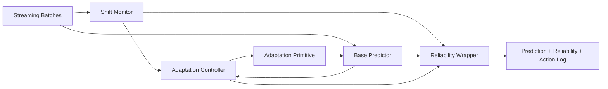

# System Design

## Goal

Build a research prototype that treats automatic adaptation as a **controlled system**, not just a model-update rule.

The prototype should answer:

1. can we detect harmful shift early enough to intervene?
2. can we choose a safe intervention automatically?
3. can bounded adaptation outperform both a frozen model and a naive always-adapt baseline?

## Design Principles

### 1. Separate monitoring from adaptation

The monitor should estimate whether the operating environment has changed. The adaptation policy should decide what to do about that change. This separation keeps the system auditable and lets us improve either side independently.

### 2. Keep interventions ordered by risk

The system should prefer the cheapest safe intervention:

- do nothing
- recalibrate
- adapt a small parameter subset
- reset selectively
- escalate to full retraining later

### 3. Preserve a path back to source knowledge

A deployed model needs a stable anchor. Source checkpoints, source sketches, and reset logic are first-class system features, not debugging hacks.

### 4. Treat continual adaptation as a control problem

The important decision is not only how to update parameters, but when to update, how often, with what intensity, and when to stop.

## V1 Architecture

The first serious prototype uses a simple streaming benchmark but mirrors the long-term architecture.

## Core Modules

### Stream Environment

Responsibility:

- generate batches across multiple regimes
- give all baselines the exact same stream

V1 implementation:

- synthetic binary stream with stable, gradual-shift, abrupt-shift, and recurring regimes

Why it matters:

- baseline comparisons are meaningless if each strategy sees a different stream

### Base Predictor

Responsibility:

- produce predictions
- expose a bounded adaptation interface
- preserve access to source parameters for reset

V1 implementation:

- tiny online logistic model with `predict_proba`, `predict`, `adapt`, and `reset`

Longer-term upgrade path:

- small PyTorch model
- adapter- or LoRA-style update target

### Shift Monitor

Responsibility:

- convert each batch into a shift signal
- provide both scalar severity and directional information

V1 implementation:

- feature mean drift
- feature variance drift
- aggregated scalar shift score

Longer-term upgrade path:

- latent MMD
- covariance drift
- output entropy drift
- conformal martingale or confidence-sequence risk monitoring
- graph topology drift features

### Adaptation Policies

Responsibility:

- define how the system reacts to shift

V1 policies:

- `frozen`: never adapt
- `naive`: adapt immediately when a shift threshold is crossed
- `controller`: adapt conservatively with cooldowns and reset logic

Why this matters:

- this benchmark makes the research question concrete
- if controller-gated adaptation cannot beat naive adaptation, the controller thesis is weak

### Reliability Wrapper

Responsibility:

- summarize confidence, shift severity, and recent intervention state

V1 implementation:

- confidence from predicted probabilities
- reliability score from shift magnitude
- trust state from alert plus action

Longer-term upgrade path:

- adaptive conformal prediction
- abstention thresholds
- risk-controlled prediction sets

### Evaluation Harness

Responsibility:

- run all strategies on the same stream
- compute overall and regime-specific metrics
- make comparisons reproducible

V1 metrics:

- overall accuracy
- regime-wise accuracy
- alert count
- adaptation count
- reset count
- mean shift score
- mean reliability score

Longer-term metrics:

- harmful adaptation frequency
- time to detect harmful shift
- recovery time
- collapse frequency
- accuracy delta versus frozen over time
- calibration and coverage under shift

## Control Logic

The V1 controller is intentionally simple but structurally correct.

### Inputs

- current shift score
- drift direction
- recent controller state:
  - cooldown counter
  - count of consecutive severe shifts

### Actions

- `none`
- `hold`
- `adapt`
- `reset`

### Policy

- below mild threshold: do nothing
- during cooldown: hold
- above mild threshold: adapt conservatively
- if severe shift persists: reset to source parameters

This policy is primitive, but it already captures the key system concept: adaptation is conditional, stateful, and reversible.

## Why This Design First

This design is not the final research system. It is the smallest architecture that still preserves the main scientific structure:

- one monitor
- multiple intervention strategies
- one controller
- one rollback path
- reproducible stream evaluation

That gives us a clean foundation for adding stronger pieces later without rewriting the whole project.

## Planned Upgrades

### Upgrade 1: Better monitoring

- latent-space drift
- output collapse indicators
- sequential harmful-risk tests

### Upgrade 2: Better adaptation target

- parameter-efficient adapter
- output-head adaptation
- source-sketch anchoring

### Upgrade 3: Better controller

- multi-timescale windows
- uncertainty-gated updates
- selective resets
- learned or online controller instead of rules only

### Upgrade 4: Better realism

- temporal benchmark datasets
- tabular shift benchmarks
- graph-structured streaming benchmarks

## Near-Term Engineering Tasks

1. keep the benchmark harness stable and reproducible
2. add per-step logging so we can inspect failure cases
3. add richer baselines before introducing more sophisticated methods
4. upgrade one component at a time so attribution remains clear

## Success Condition for This Stage

This stage is successful if the codebase can support a fair answer to:

**When does controller-gated adaptation outperform both a frozen model and naive adaptation, and under what shift regimes does it fail?**
